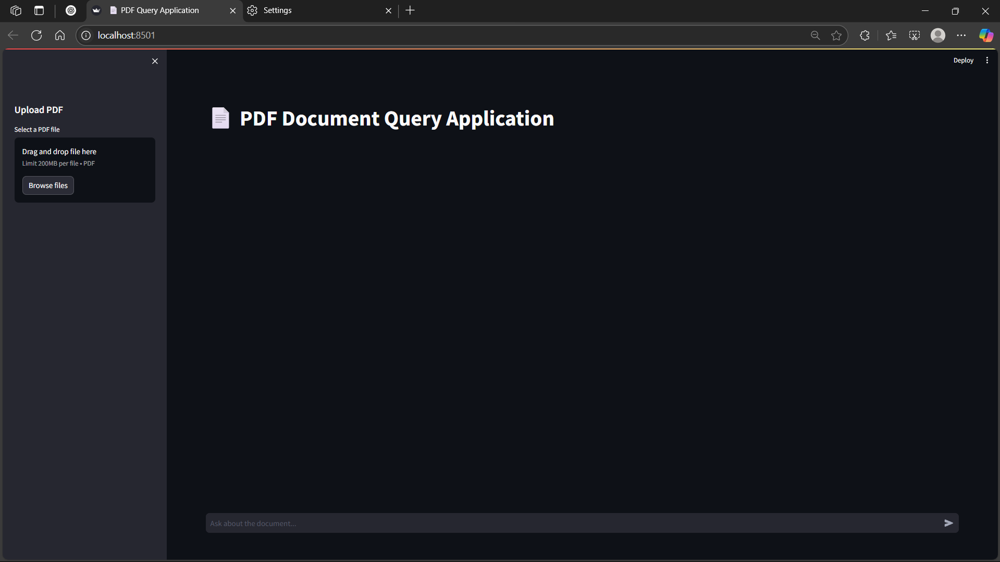
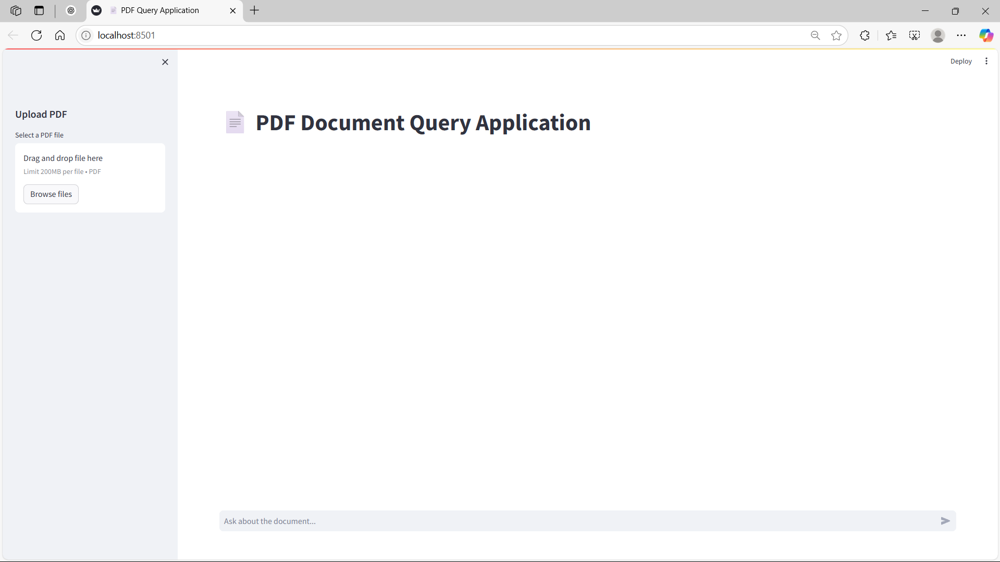
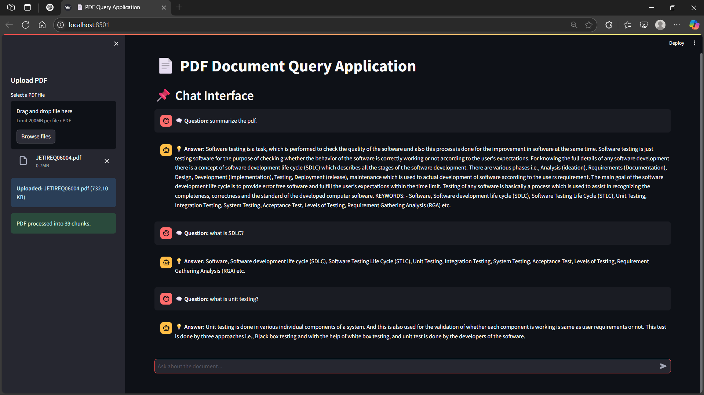
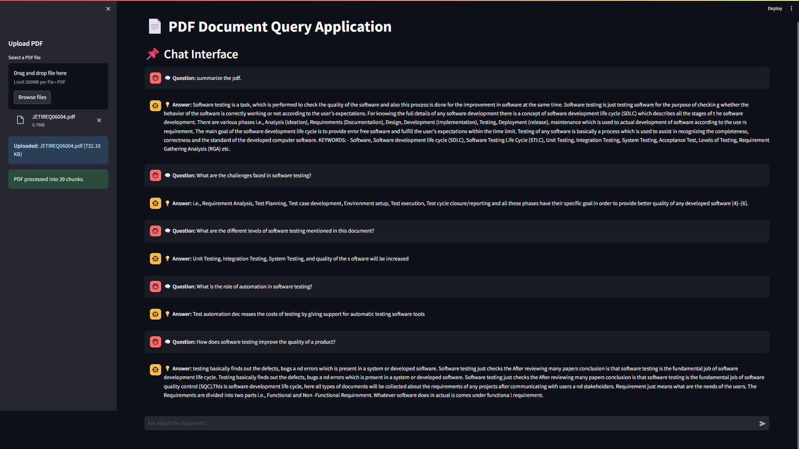
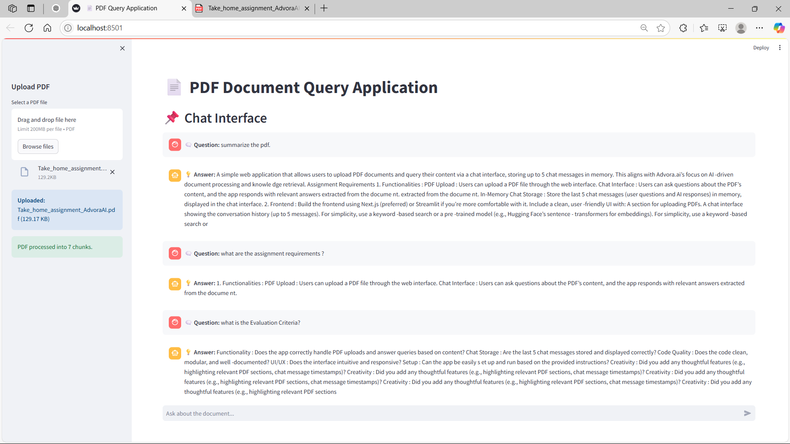

# 📄 PDF Query App (Streamlit Version)

This is a lightweight, Streamlit-based version of the PDF Query App. It allows you to upload a PDF and ask natural language questions about its content using AI.

---

## 🚀 Features

- Upload PDF documents
- Ask questions in plain English
- Get instant answers powered by AI
- Built with Streamlit, LangChain, and PDF processing libraries

---
1. Clone the Repository  
    ```bash
    git clone https://github.com/ASUTOSH133/pdf-query-app-streamlit.git 
    cd pdf-query-app-streamlit
    ```

2. Create a Virtual Environment  
    ```bash
    python -m venv venv
    ```

3. Activate the Virtual Environment  
    Windows:
    ```bash
    venv\Scripts\activate
    ```
    macOS/Linux:
    ```bash
    source venv/bin/activate
    ```

4. Install Dependencies  
    ```bash
    pip install -r requirements.txt
    ```

5. Run the Application  
    ```bash
    streamlit run app.py
    ```

## 📸 App Screenshots

### 🔍 Home Screen



### 💬 Query Result





